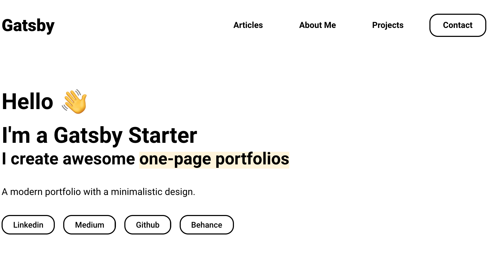

---

To learn more about it, have a look at the [Readme of Portfolio Minimal](https://github.com/konstantinmuenster/gatsby-theme-portfolio-minimal/tree/main/gatsby-theme-portfolio-minimal#readme).

Konstantin Münster – [konstantin.digital](https://konstantin.digital)
